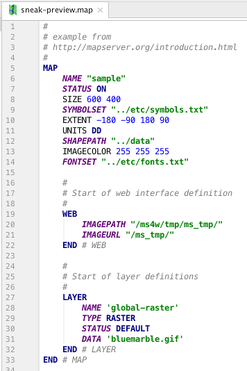

# IntelliJ Mapfile Plugin

Editor support for Mapfiles of the UMN Mapserver. It supports Mapserver Release 7.0.4

## Features

*  Syntax Validation
*  Syntax Highlighting (Color Settings Page)
*  Helpers and Utilities
*  Autocompletion (Ctrl+Space)
*  References
*  Find Usages (Alt+F7)
*  Folding
*  Structure View
*  Formatter (Cmd+Shift+L)
*  Quick Fix (Cmd+Return)
 

## Resources

* Mapfile Documentation 
http://mapserver.org/documentation.html#mapfile

* Custom Language Support Tutorial 
http://www.jetbrains.org/intellij/sdk/docs/tutorials/custom_language_support_tutorial.html

* Backus-Naur Form (BNF) to define the Mapfile's grammar 
https://en.wikipedia.org/wiki/Backus%E2%80%93Naur_form